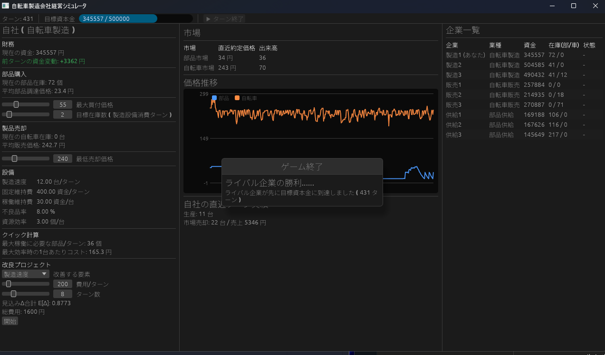

# 自転車製造業シミュレータ (cycle-maker)

Bevyで作った自転車製造会社の経営シミュレータ．
プレイヤーは製造会社1社を操作して目標資本金への到達を目指す．

## 概要

- プレイヤーは自転車製造会社の経営者．部品を市場から買い付け，設備で自転車を製造し，市場へ売る．
- NPC企業 (供給・製造・販売) も同じルールで自律的に売買・設備改良を行い，需給によって価格が変動する．

供給企業 -(部品市場)-> 製造企業 -(自転車市場)-> 販売企業

## 勝敗条件

- 勝利: 資本金が目標額 (初期資金の10倍) に到達．初期資金は 100,000，目標は 1,000,000．
- 敗北: 資金が負になって倒産．

## プレイヤーの操作

- 価格: 部品の最大買付価格と，自転車の最小販売価格をスライダーで指定する
- 発注方針: 目標在庫ターン数．買付・売出の数量はここから自動算出される
- 改良: 5つの設備パラメータ (製造速度・固定維持費・稼働維持費・不良品率・資源効率) から1つを選び，費用/ターンと期間を決めてプロジェクトを開始する

